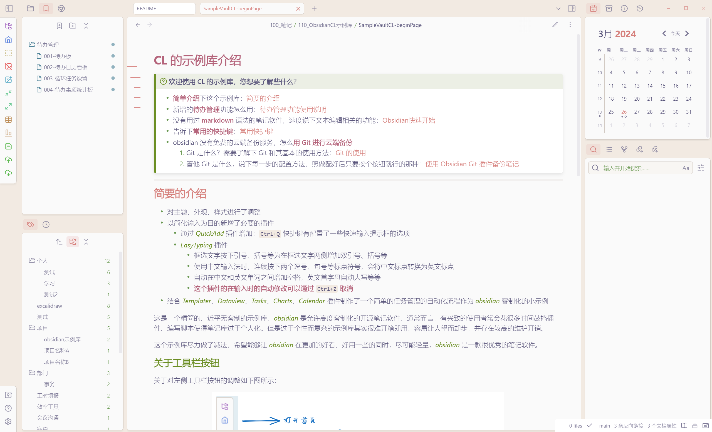
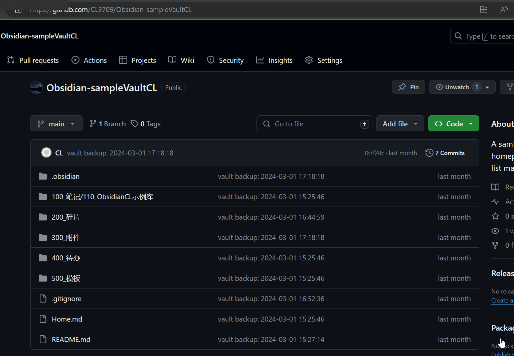
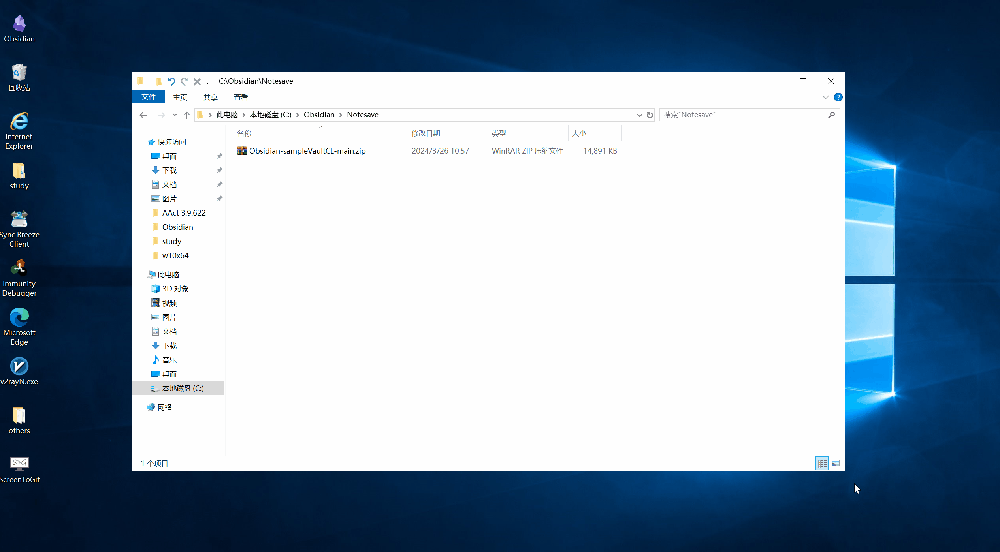

# Sample Vault by CL

## 说明

通常情况下 obsidian 是一款需要 “装修” 一下的笔记软件，虽有很高的客制化空间，但是有不少插件基本上可以算是必装插件。这个示例库安装了这些必要插件，并制作了一个 “待办任务管理” 的小功能作为深度客制化的小示例，同时基于个人喜好调整了软件外观。

## 安装和使用

### 在 obsidian 的官方网站下载安装 *obsidian* 软件

网页链接 -> [Obsidian - Sharpen your thinking](https://obsidian.md/)

### 在 github 下载我的示例库

网页链接 -> [CL3709/Obsidian-sampleVaultCL: A sample vault of Obsidian, featuring a homepage, guidance manual, and to-do list management functionality. (github.com)](https://github.com/CL3709/Obsidian-sampleVaultCL)

选择 Download ZIP 选项即可

解压并使用 obsidian 打开本地仓库即可，如果打开的时候 home 页面的脚本没有正常运行, 初次加载视网络情况可能较慢，请等待一会儿后重新打开 home 页面即可。

